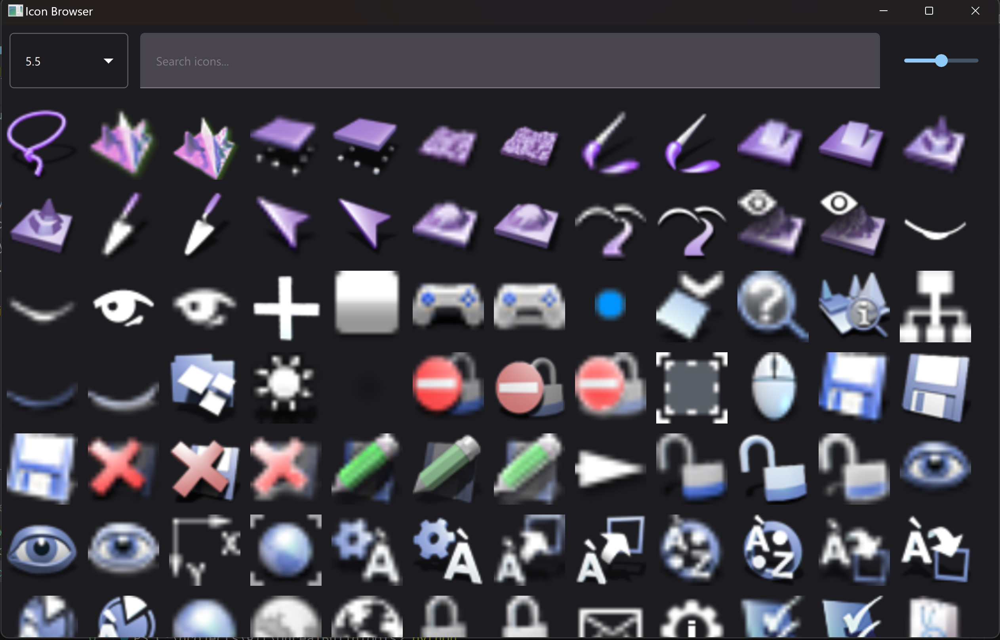

# UnrealBuildTools

A collection of custom deployment and development tools for Unreal Engine plugins.  
These are made for my personal use but shared in the hope it may be helpfule.

Specifically there are 3 tools here to assist in deploying FAB plugins.

compile_plugin.bat/.sh is used to quickly compile a uplugin against any installed unreal version.

package_plugin_for_fab.bat/sh is used to validate and package a plugin for distribution to FAB marketplace, it will pick up on some common issues that may stop you deploying and updates the uplugin engine version for each version it packages for. This is specifically for code that is exactly the same across versions.

icon_finder.bat/sh is a simple qml based icon browser that will show you all the icons that are available across all specified versions, clicking an icon copies the path.  This is useful when wanting to use in-engine icons in your plugin.

## Requirements

python 3.7+.  
PySide6 is required to run the icon_finder.  

## Available Tools

### Package Plugin for FAB (`package_plugin_for_fab`)

Package an Unreal Engine plugin for Forum Asset Bundle (FAB) distribution.

```bash
package_plugin_for_fab -p path/to/plugin -o output/dir -v 4.27 5.0 5.1
```

Options:
- `-p, --plugin`: Path to .uplugin file or containing directory
- `-o, --output`: Output directory for packages
- `-v, --versions`: UE versions to package for (default: 4.27-5.5)
- `-e, --engine`: Engine version for validation
- `--skip-validation`: Skip validation checks
- `--verbose`: Enable verbose logging

### Compile Plugin (`compile_plugin`)

Compile an Unreal Engine plugin for the current platform.

```bash
compile_plugin path/to/plugin -e 5.1 -o output/dir
```

Options:
- `--engine-version, -e`: Unreal Engine version
- `--output, -o`: Output directory for compiled plugin
- `--verbose, -v`: Enable verbose logging

### Icon Finder (`icon_finder`)

Browse and search Unreal Engine's built-in icons across different engine versions.



```bash
icon_finder --versions 5.0 5.1 --icon-types svg png
```

Options:
- `--base-path`: Base path for UE installations
- `--versions`: UE versions to search
- `--icon-types`: Icon types to include (svg/png)

## License

MIT License - See LICENSE file for details
